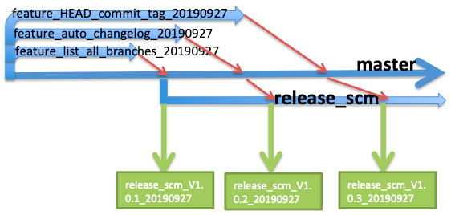

#  (2019-09-28)

### Features

* add an empty shell file as 1st commit ([c1ebcfe](https://github.com/dbtang/software_configuration_management/commit/c1ebcfe))
* add an shell get all change log ([2d01ea7](https://github.com/dbtang/software_configuration_management/commit/2d01ea7))
* add shell file to tag HEAD commit ([cb57fa8](https://github.com/dbtang/software_configuration_management/commit/cb57fa8))
* add shell to get all branches ([1893dc8](https://github.com/dbtang/software_configuration_management/commit/1893dc8))

#  (2019-09-27)

### Features

* add an empty shell file as 1st commit ([c1ebcfe](https://github.com/dbtang/software_configuration_management/commit/c1ebcfe))
* add an shell get all change log ([2d01ea7](https://github.com/dbtang/software_configuration_management/commit/2d01ea7))
* add shell file to tag HEAD commit ([cb57fa8](https://github.com/dbtang/software_configuration_management/commit/cb57fa8))
* add shell to get all branches ([1893dc8](https://github.com/dbtang/software_configuration_management/commit/1893dc8))

### 脚本功能列表

|  分支名   | 功能  |
| :-----  | :-----  |
| auto\_changelog.sh  | 自动生成changelog |
| get\_all\_branches.sh  | 获取所有分支并输出到文件 |
| git\_HEAD\_commit\_tag.sh  | 给最新的commit打tag |

### 分支版本图

